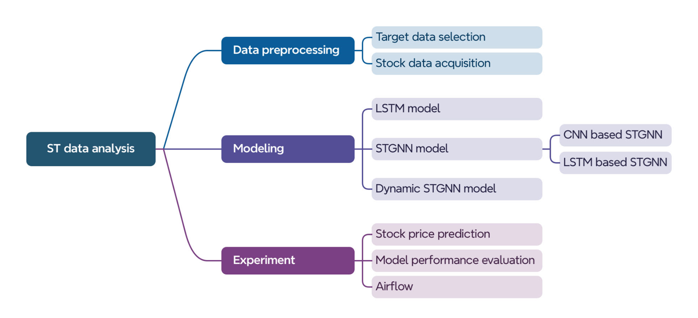
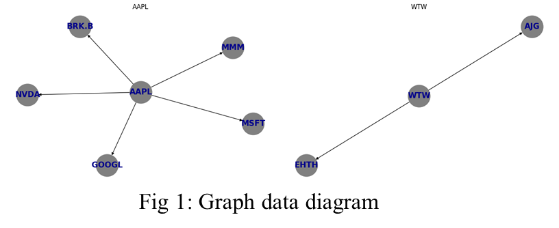

## EECS E6893 Fall of 2023

### Project: **Financial Analysis on Spatio-Temporal Graph Data** 

### Team 14: Shaokun Feng(sf3209), Qingyuan Liu(ql2505), Xinzi Yu(xy2590)

 

**This project presents a comprehensive exploration into leveraging Big Data Analysis to predict stock prices using Spatio-Temporal Graph data. Focused on S&P 500 companies, the study delves into the complexities of financial markets, aiming to construct dynamic relationships between companies and develop predictive models. The report outlines meticulous data collection, preprocessing methodologies, and the development of predictive models—LSTM for temporal data and STGCN for static and dynamic Spatio-Temporal data. It discusses experimental outcomes, visualization strategies, and references recent works in the field. The endeavor seeks to contribute to revolutionizing financial forecasting and decision-making processes by enhancing predictive analytics in the financial domain.**

### Tree Diagram of Project Body

### Data Generation

**Target data selection:**

•Step 1: Identify companies from the S&P 500 list, analyzing the HTML structure of the Yahoo economic news website for each company to extract relevant news titles.

•Step 2: After crafting web crawlers to extract company-specific news titles, we detect and confirm company mentions within the extracted text.

**Stock data acquisition:**

•Step 1: Obtain comprehensive stock data for each identified company using the Finnhub library. 

•Step 2: Construct a spatio-temporal graph

| **Type**            | **Value** |
| ------------------- | --------- |
| **Nodes**           | 503       |
| **Edges**           | 4255      |
| **Features**        | 5         |
| **Temporal Length** | 3650      |

